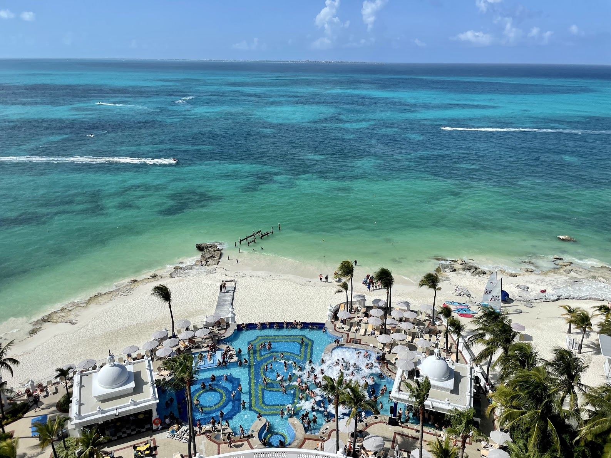

## Flights ✈️

Over the Fourth of July weekend, I met Kayla and her siblings for a short, relaxing vacation in Cancún.

The flights were mostly uneventful though we flew separately as I am currently living in Florida while Kayla finishes up her pharmacy residency in Kentucky. I flew Frontier from Tampa and had a very short flight with no worries. I only brought a backpack which fits under the seat in front of me - easily the best way to travel!

After arriving in Cancún, we quickly realized that I was on a separate terminal from everyone else - and the only shuttle had just left. I was told it would be 40 minutes to get picked by the next shuttle to go meet up with Kayla, so I grabbed a taxi and, painstakingly, directed Kayla and her siblings to where we needed to pick them up. After that, it was smooth sailing to the Hotel Zone!

We stayed at the [Hotel Riu Palace Las Americas](https://www.riu.com/en/hotel/mexico/cancun/hotel-riu-palace-las-americas/) which I thought was a pretty nice place to stay. I don't have as much experience with all-inclusives as my (future) sibling-in-laws, but I was pretty happy with our resort.

The all-inclusive hotel was truly all-inclusive, with tips included as well. None of the waiters, cleaning staff, or concierge pressured you for tips and provided us with great customer service during our stay.

The food was pretty solid - breakfast and dinner being a bit better than lunch. We ate at a few different hotel restaurants - _Fiesta Mexicana_ (mexican food), _Sakura_ (japanese), _Black & White_ (steakhouse), and _Los Arcos_ (italian). My favorite was probably _Sakura_, which served gyozas, sushi, and seared ahi 🤤.

The ocean was absolutely beautiful - crystal clear and the perfect cool temperature to swim in! The infinity pools were a bit warm, but were pretty nice to look out over the ocean.

Other than that, we visited an old lighthouse and stayed up late watching really bad music videos on the giant projector that was set up near the main bar!

Our hotel room was a bit dated, but that isn't super important to us. Overall, it was a nice place to recover from the heat and provided us with a breathtaking view of the "party pool" and the ocean below!

