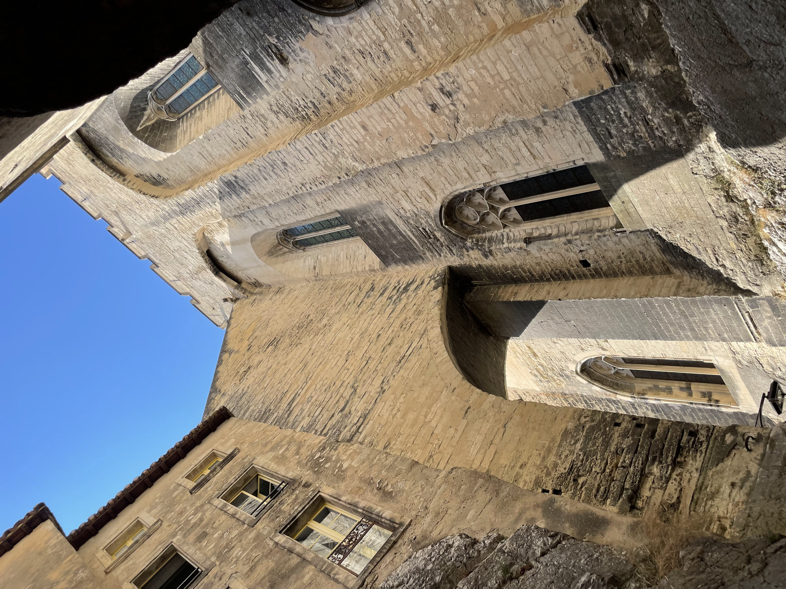
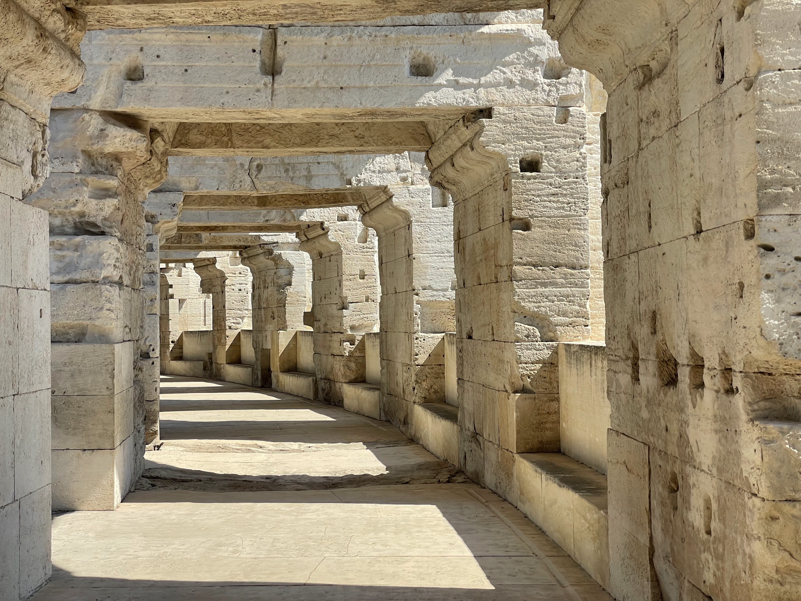
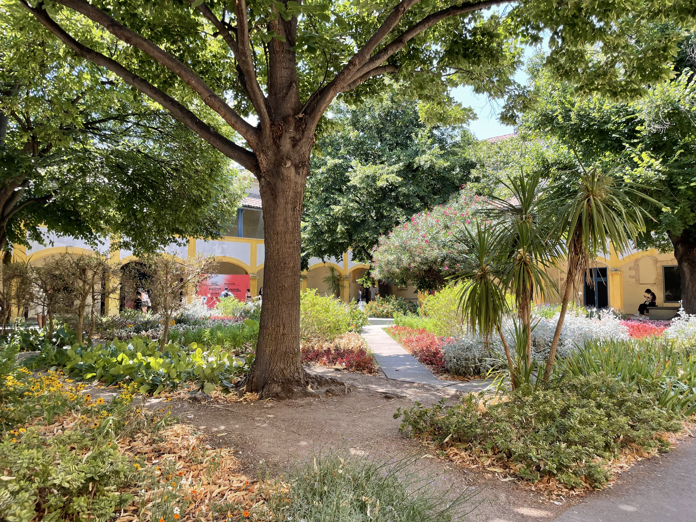
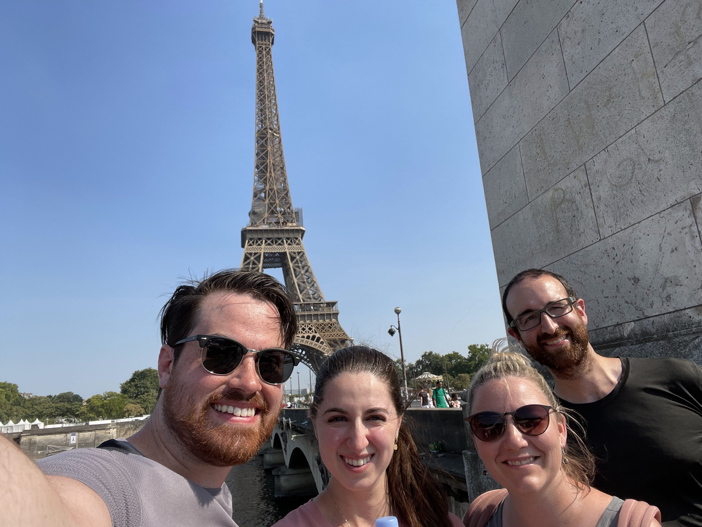
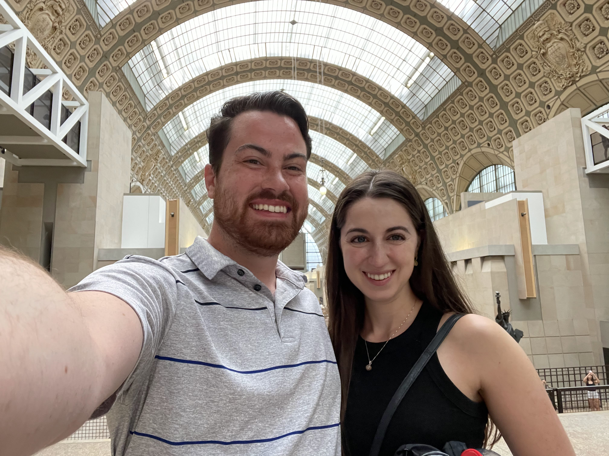
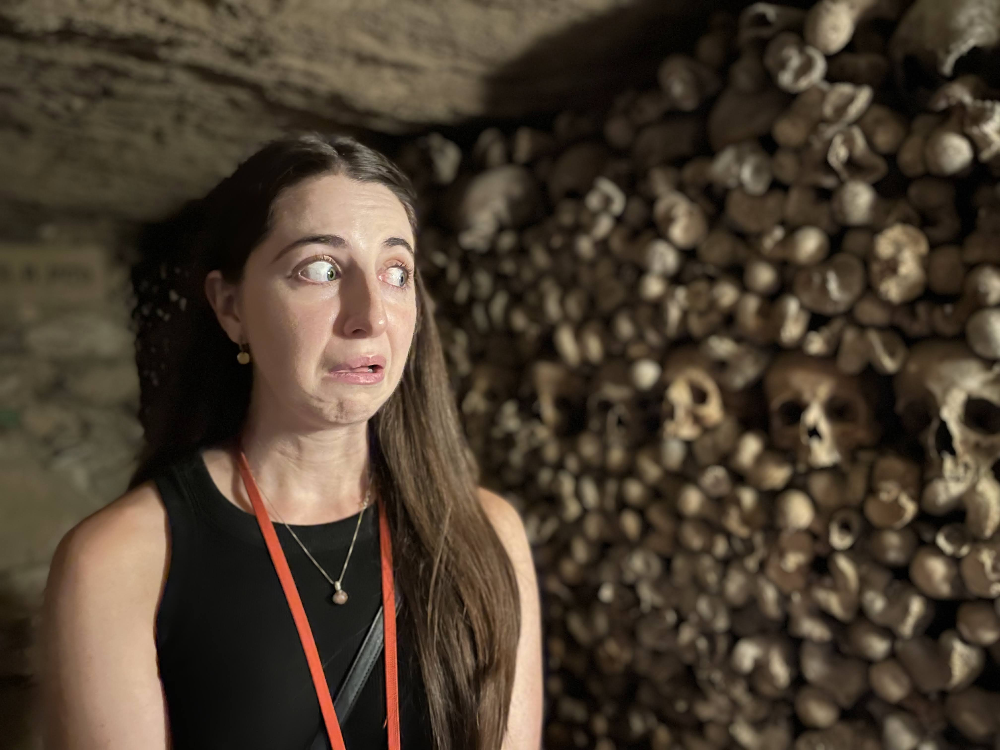
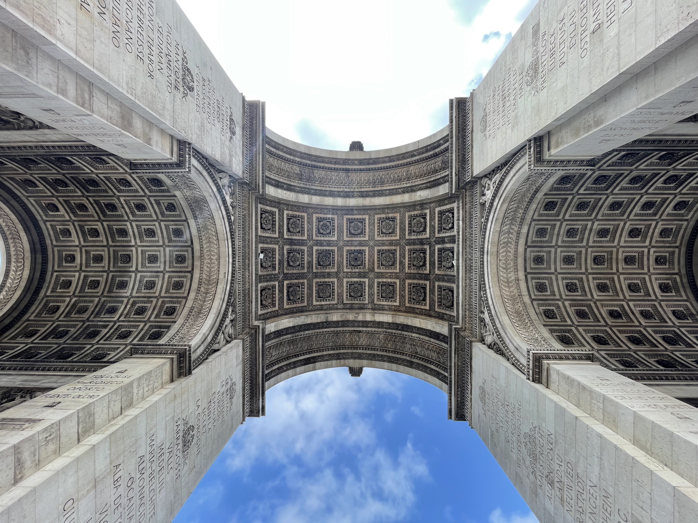
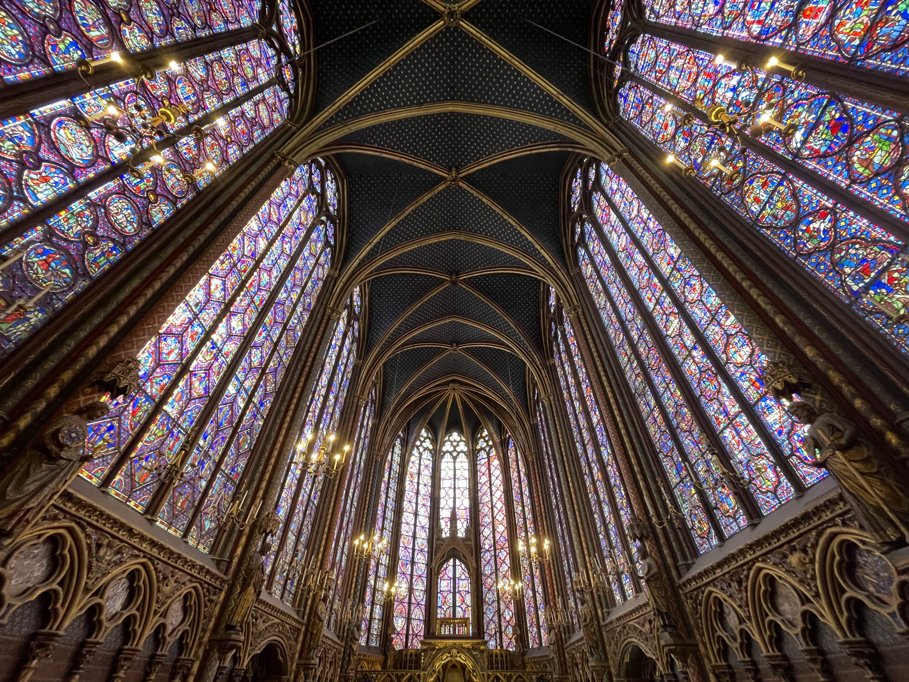

## Travel ✈️

After [our trip to Cancún](/posts/2022/trip-to-cancun/), I flew back home while Kayla & her eldest brother & sister-in-law flew off to Europe (without me). They spent about a week traveling through the Netherlands & Belgium before I was able to catch up with them in France.

If you've never traveled alone before, it can be a pretty strange experience - I feel like I went a day or so while traveling not talking to anybody! I flew into Paris & then traveled by train from Paris to Avignon to meet up with Kayla & the rest of our crew.

## Avignon

Unfortunately, I didn't get to spend much time enjoying Avignon. In addition to being jetlagged, France was having one of its worst heat waves (like... ever)... so I was a bit tired 😪.

By the time I made it to Avignon, I think Kayla & her family had already walked all over town. The first thing we did together was visit the _Palais des Papes_, a gothic fortress/palace, which hosted a number of popes & a few antipopes during the 14th & 15th centuries.

## Arles

After Avignon we took a train over to Arles to see some more sights. Our first stop was the _Arènes d'Arles (Arles Amphitheatre)_. I am always amazed at how much history there is in Europe - this building was built in 90 AD - and I can just.. walk inside?!

In addition to the ancient history, Arles also hosted Van Gogh in the late 19th century. Van Gogh painted many of his most famous artworks in Arles such as _Café Terrace at Night_, _Starry Night Over the Rhône_, & _Bedroom in Arles_.

We walked around the entire city looking at the various locations that inspired Van Gogh's stunning artworks, including the hospital he was housed in while recovering from his well-known mental health breakdown that resulted in him removing part of his own ear.

## Paris - 104° 🔥

After Arles, we headed north to Paris where we would have a few more days before our travels for 2022 came to a close. As I mentioned before, the temperatures were absolutely off the charts - I truly think the first day in Paris was the hottest I've ever felt in my life (and yes, I live in Florida).

> **🔥 Fun Fact**
>
> The day we arrived in Paris (July 19, 2022) was the city's third hottest day in recorded history ([source](https://www.extremeweatherwatch.com/cities/paris/highest-temperatures)).

Of course, the heat wasn't going to stop us - we trekked for miles all over the city and checked out the _Eiffel Tower_ to close out our travel day. While the locals were cooling off in the fountains, we found a nice spot near the river to cool off and admire the view!

## Paris - Museum Day

The next day Kayla and I were on our own, so we decided to make it a museum day! We were able to stay out of the heat a bit by visiting the _Musée d'Orsay_ followed by the _Jardin des Tuileries_ and, finally, the _Musée du Louvre_.

I have to say the _Musée d'Orsay_ was incredible - a much better experience than the _Musée du Louvre_ ended up being. I feel like the _d'Orsay_ was the perfect size to walk through the whole thing & not be tired at the end.

The _Musée du Louvre_ was also great, but I think it can be too crowded & is too large to feel "attainable" - you definitely have to pick & choose which exhibits to skip.

## Paris - Kayla's Birthday 🎂

Kayla's birthday coincided with this trip so she got to pick out the activity of her choice for her special day. Unsurprisingly, she chose _Les Catacombes de Paris_ 💀.

After the catacombs we bounced over to the _Arc de Triomphe_, followed by the _Musée Rodin_, and finally the _Basilique du Sacré-Cœur de Montmartre_. By the end of the day, we went back to the spot we found by Seine and watched the _Eiffel Tower_ sparkle ✨.

## Paris - Final Day

For our last day in Paris, we visited _Notre-Dame_ which was under heavy construction so we couldn't see much of it. I would say we more than made up for that disappointment, however, by visiting _Sainte-Chapelle_ which absolutely blew us all away.

I'll never forget being largely unimpressed by the first room the _Sainte-Chapelle_ tour took us to. A small, dark room with various relics inside & a bunch of text to read some history - "this is it, huh?" Then we see a few people heading through the door to next tour location, which involved a tight staircase, and I hear the people in front of me say "Oh my god." The moment you reach the top of the staircase, you'll understand what inspired that exclamation.

After that, we visited the _Panthéon_ (not the Roman one) and _Le Centre Pompidou_ (modern art museum) to finish out our stay in Paris.

## Final Thoughts

France was incredible - I loved seeing all of the art & historical monuments. It amazes me how old much of the art & architecture is across Europe as a whole.

As always, I feel incredibly lucky to be able to travel as much as Kayla and I do. We are unbelievably fortunate to be able to visit & learn about the history, food, & culture of other peoples.
