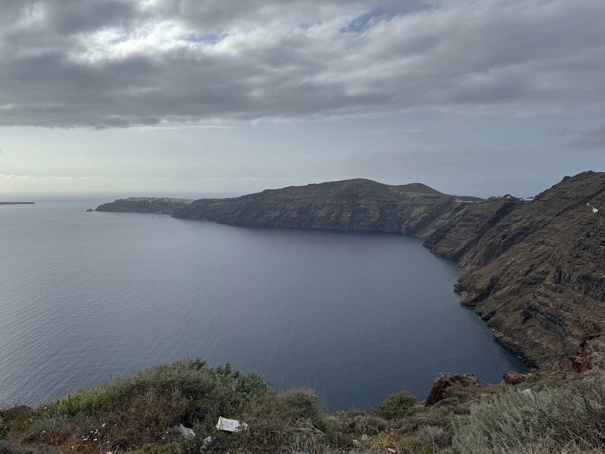
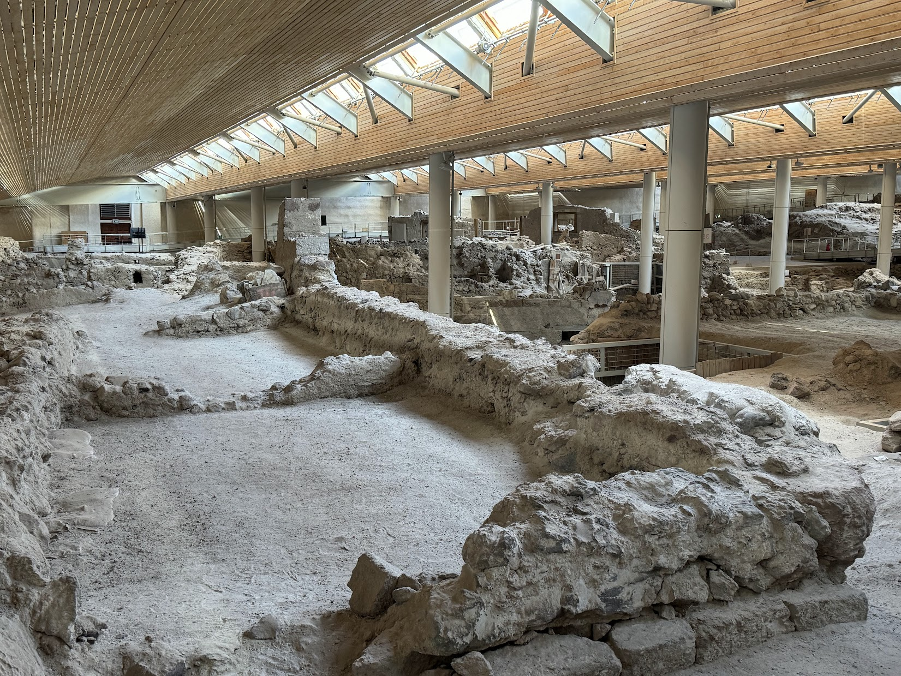
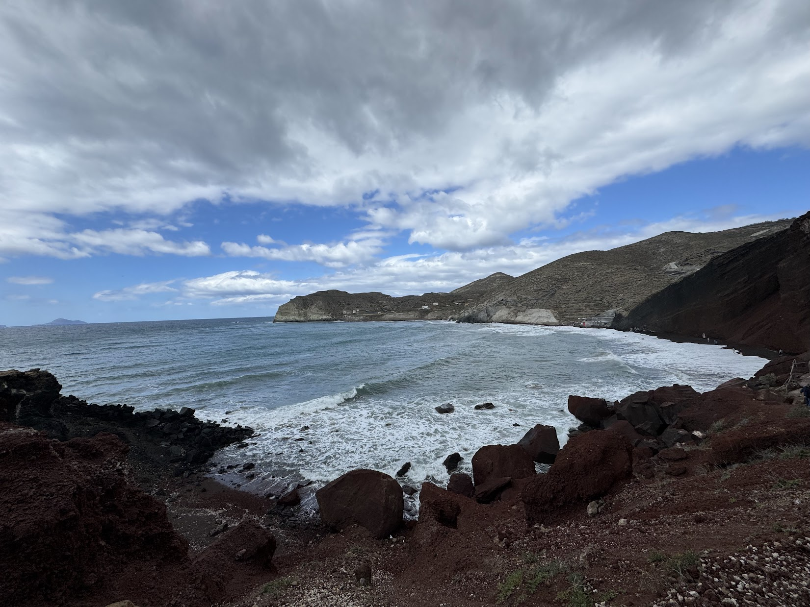
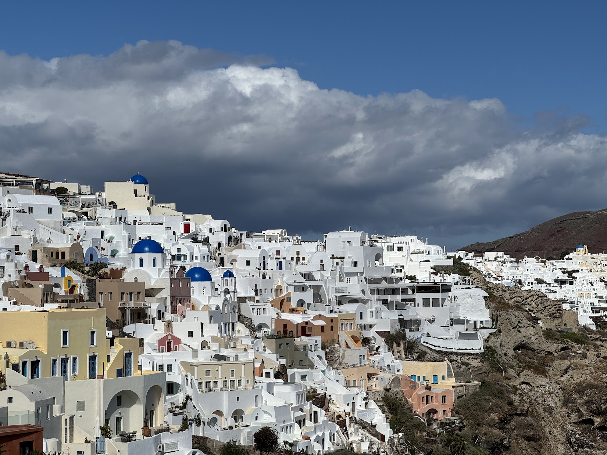
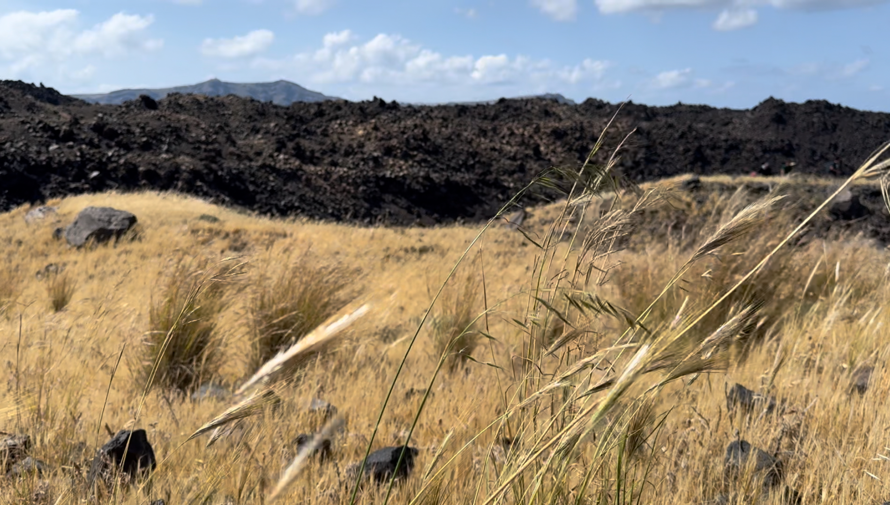
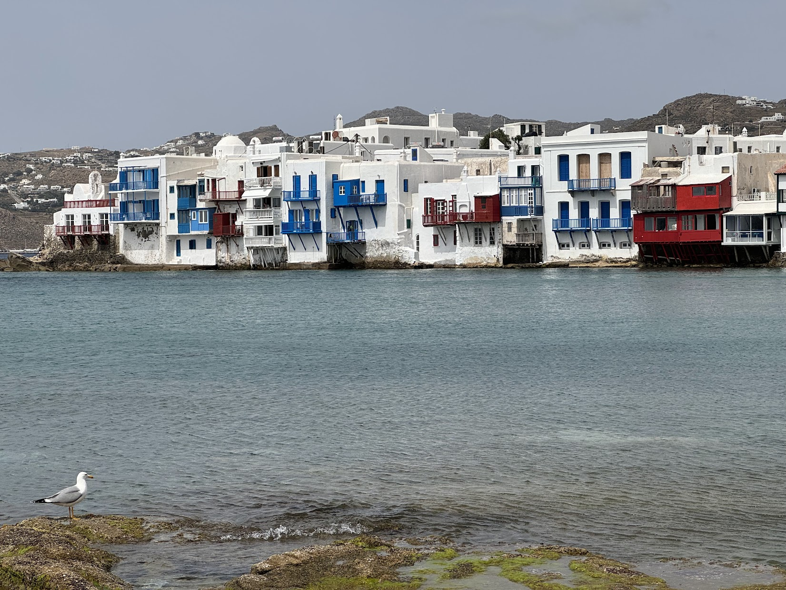
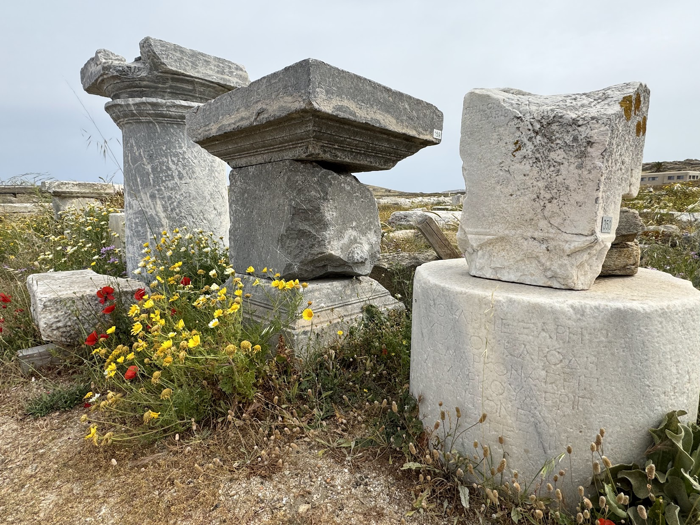

## Getting to Greece ✈️

This was way more stressful than expected... the day we were leaving I woke up at 6am thinking about how excited I was to get on the road! I turn over in bed & see a message from Air Canada indicating that our flight was rebooked and we wouldn't arrive in Greece until much later than expected... (insert "this is fine" meme).

After weighing the pros & cons of awaking Kayla from her slumber, I decided she'd want to know ASAP. I explained to her that we'd be arriving in Athens too late to reach Santorini on the flight we had already booked. Once she realized I wasn't making a really terrible joke she exclaimed "What are we gonna do in Athens!?!" which I found to be hilarious. My first thought was "well, I guess we'll have to just enjoy our ouselves in Athens..."

Anyways, Air Canada helped us out & got us booked on another flight that would arrive in time. There were a few more delays in the process, but we eventually arrived in the Athens airport, met Michael & Lyndsie (my sibling-in-laws), and boarded our final flight to the island of Santorini!

## Santorini

I have to say, we were pretty baffled when we got to our hotel and couldn't see the islands in the caldera. Lyndsie (sister-in-law) and I were talking about it and said "huh, I had thought we'd be able to see the islands better." It wasn't until we walked to dinner that we turned a corner and were like "OH, there it is" that we realized our hotel faced the _other_ side of the island 😅

### Akrotiri

Our first point of interest was to check out the prehistoric town of Akrotiri where we could check out the remnants of this town. The archaeological site was very impressive - I had never seen a fully covered archeological site before!

### Red Beach

Only a short walk away, Red Beach was our second destination in Santorini. We hiked around it for a while & admired the red & black sand - the colors come from the volcanic activity of this island!

### Oia

After exploring as much as we could on the south side of the island, we took a cab to the north side & visited the village of Oia. This town is famous for its blue domes & bells - it really was quite stunning seeing that the whole town was painted white with these brilliant blue domes interspersed.

### Nea Kameni & Palea Kameni

The following day we booked a tour to visit the volcanic island of Nea Kameni & visit the hot springs off the coast of Palea Kameni. This trip was pretty neat - we had a tour guide who walked with us around the volcano. The colors on the island were incredible - the black, volcanic stone mixed with the yellow-gold of the wild wheat growing all over 😍

After we hiked all over the volcano, our next stop was the hot springs of Palea Kameni. I thought this part was super fun - we had to jump off the boat and swim to the hot springs. The water was incredibly cold and unfortunately the hot springs are lukewarm at best. Overall, however, I thought it was a fun time - Kayla might disagree! 🥶

## Mykonos

We took a ferry from Santorini to Mykonos the following day - it was a breeze! After we got checked into our hotel we strolled around the town of Mykonos. We checked out the windmills, did some shopping, and prepared for our adventure to Delos, which was the main reason we were coming to Mykonos!

### Delos

Another ferry - this time to the ancient ruins preserved on Delos! This island was awesome! There were ruins all over the place with wildflowers growing everywhere - it was so pretty! In particular, I loved seeing the ruins of columns - I've been thinking about getting a tattoo of one!

## Athens

After Mykonos, we flew to Athens to _finally_ see the sights there!

## Meteora

## Food
