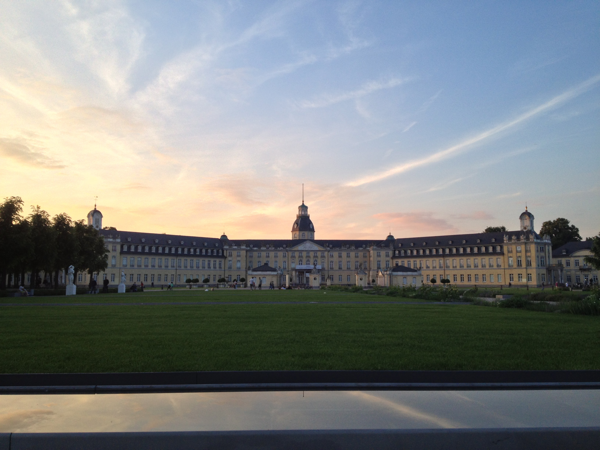

## Looking Back

Having traveled abroad twice now and hoping to travel to Europe again in the near future, I am frequently reminded of my first experience traveling across the Atlantic in the summer of 2013. This first adventure to Germany & Great Britain has sparked a passion for exploration and a desire to learn about the culture, traditions, and especially the food of other countries. My memories of traveling to Germany and Great Britain have only grown fonder over the last 8 years and I wanted to reminisce and record my favorite parts.

## Study Abroad

I was extremely lucky to be selected for a study abroad program to take Calculus III in Karlsruhe, Germany that was slated to start in June 2013 and last 5 weeks. Roughly 16 of my fellow students in the College of Engineering at the University of Kentucky and I were able to make this trip.

Each week we spent around 7 hours a day Monday through Thursday "learning" Calculus III - Fridays being used for tours of engineering facilities like the Mercedes Benz factory. Our education took place at the Karlsruhe Institute of Technology but we were taught by a professor who traveled with us from UK.

While at KIT, we spent long hours in the classroom with a few 15 minute breaks and an hour for lunch at the cafeteria. I wish I could say I remember every detail of studying at KIT, but mostly I remember the food. The cafeteria was no different from a cafeteria in the United States but the food was very German. I recall eating currywurst most days and different types of schnitzel (chicken, pork, etc) with pommes frites (french fries) on others.

## Life in the Village

Accommodations during this study abroad program were provided by host families located in Karlsruhe, Germany. I was hosted by a lovely family of four who made me feel like I was at home. My host family introduced me to German traditions & food as well as took me to visit various sights around the area. My host mom frequently brought fresh fruit, bread, and cheese from a local market for our lunches. I distinctly remember Käsebrot (literally cheese & bread) being introduced to me as a traditional German lunch.

I lived at my host family's home in Grötzingen - a suburb of Karlsruhe. I was reminded often during my stay how old the history of Europe is - the idea of walking past buildings older than America is still quite awe inspiring.

Each day, I would walk about 10 minutes to the train station and commute into the city. The train rides were always on time and always pleasant - my fellow students hopped on the same train and we had some time to catch up before class.
